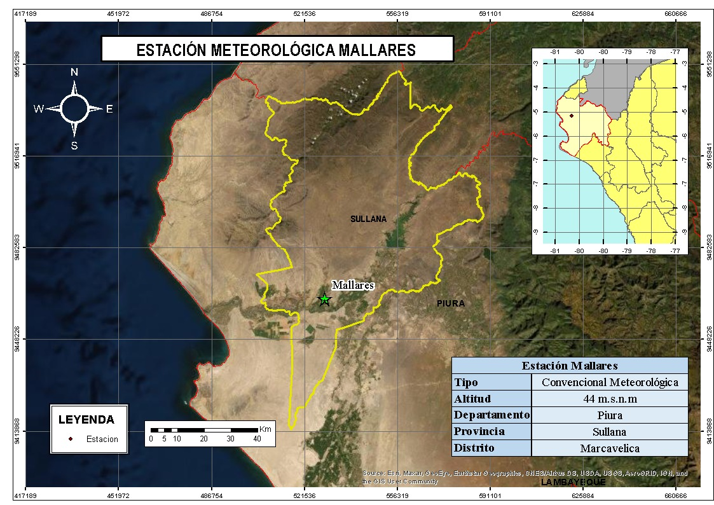

# PRESENTACIÓN DEL EJERCICIO 3 

<hl style="color: red">
<br>
**INTEGRANTES**

<br>
<hl style="color: black">
Condor Melo, Deysy
<br>
Lara Huapaya, José Alberto
<br>
Ceras Robles, Jose Alexander
<br>
Miguel Jurado, Milagros
<br>
Ramos Castillo, Elizabeth

<br>
Ingeniería Geográfica - UNMSM


# Parte 3

**Manipule los dataframe según se solicite**

Se tiene el conjuntos de datos de precipitación diaria (período 1980 - 2013) de ciertas estaciones meteorológicas (**raingaugeDataset.csv**), donde cada una de estas están asociadas a un código único (**p.e. qc00000208**). Asimismo, se tiene una lista con los nombres, códigos, coordenadas y elevación de cada una de las estaciones (**listRaingauge.csv**).

#

A cada grupo le corresponde la siguiente estación:

- **Grupo 01**: MALLARES
- **Grupo 02**: TABACONAS
- **Grupo 03**: PUERTO PIZARRO
- **Grupo 04**: MORROPON
- **Grupo 05**: SAN MIGUEL
- **Grupo 06**: CHULUCANAS
- **Grupo 07**: LAMBAYEQUE
- **Grupo 08**: EL LIMON
- **Grupo 09**: EL SALTO
- **Grupo 10**: CHUSIS

#
De lo descrito anteriormente, se solicita:

a) Determine la cantidad de **missing values** de la serie de tiempo a paso diario.
b) Calcule la serie de tiempo de precipitación **acumulada mensual** (si el # de días con missing values, en un mes, supera el 10%, la precipitación acumulada mensual será considerado como un **`NA`**).
c) Determine la cantidad de **missing values** de la serie de tiempo a paso mensual.
d) Cree una función que calcule, a partir de los datos de preicpitación mensual, la **climatología (Ene-Dic)** para el **período 1980-2010**.
e) Poltear (boxplot) la variabilidad de los valores mensuales (Ene-Dic) para el período 1980-2013.


##

La estación designada al **Grupo 01** es MALLARES y antes de iniciar con los ejercicios se procederá a:
<br>
<br>
<br>
* Leer los archivos
<br>
* Filtrar, seleccionar y ordenarlos datos de la estación asignada
<br>
* Verificarla cantidad de datos
<br>
<br>
<br>
<br>
*Las librerías a utilizar se irán cargando de acuerdo al ejercicio realizado*

## Lectura de archivos 
<br>
<br>
``` {r}
data<-read.csv("https://raw.githubusercontent.com/ryali93/ProgramacionR/master/data/raingaugeDataset.csv")
data2<-read.csv("https://raw.githubusercontent.com/ryali93/ProgramacionR/master/data/listRaingauge.csv")
```
<br>
<br>
<br>

Se ha leído los archivos con la función `read.csv`.

## Filtrar, seleccionar y ordenarlos datos 

Se utilizará la librería `dplyr` que se encuentra en el paquete `tidyverse`
<br>
``` {r, message=FALSE }
library(dplyr)
```

```{r}
cod<-data2 %>% dplyr::filter(NOM_EST=="MALLARES") %>% select(CODIGO)
cod
```
Con `filter` y `select` se obtuvo el código de la estación ubicada en el archivo data2.

##



## Procesamiento:

``` {r}
datos<-data %>% select(date,qc00000208)  %>% 
  mutate(date = as.Date(x = date,format="%d/%m/%Y")) %>% 
  rename(pp_Mallares = qc00000208,fecha= date) %>% 
  arrange(fecha) %>% 
  as_tibble(data)
datos
```
##
Se crea un objeto denominado `datos`, con `select` se obtiene los datos de precipitación, además se crea una nueva columna con `mutate` que contendra los datos de la fecha que han sido transformados a una clase datos con `as.Date` y luego se renombra la variable con `rename` para fines prácticos.

Con la función `arrange` ordenamos los datos de la fecha y posteriormente cambiamos la estructura de los datos a un `tibble`.


## Verificar la cantidad de datos
 
Para verificar si no falta ninguna fecha se procede a verificar la cantidad de datos con `nrow`.
``` {r }
nrow(datos)
```
Se evalúa con un vector que contiene la misma secuencia de fechas.
``` {r}
seq(as.Date("1980-01-01"),as.Date("2013-12-31"),by= "day") %>% length()

```

## 
De lo descrito anteriormente, se solicita:

**a.** Determine la cantidad de *missing values* de la serie de tiempo a paso diario.

``` {r}
pp_d<- datos %>% dplyr::filter(is.na(pp_Mallares)) %>% nrow()
pp_d
```

Se procede a filtrar los datos y con la función `is.na` nos devolverá aquellos datos que no tienen valores, por último contamos con `nrow` las filas para determinamos que tenemos 558 valores de NA.


## 
**b.**  Calcule la serie de tiempo de precipitación **acumulada mensual** (si el # de días con missing values, en un mes, supera el 10%, la precipitación acumulada mensual será considerado como un NA).
<br>
<br>
Cargamos la librería `stringr` que nos permitira utilizar la función str_sub() 
<br>
<br>
```{r message= F}
library(stringr)
```

##

``` {r }
pp_acmes<- datos %>% group_by(fecha = str_sub(fecha,1,7)) %>% 
  mutate(missv_p = sum(is.na(pp_Mallares))*100/n()) %>% 
  mutate( missv_na= ifelse(missv_p >= 10,NA, pp_Mallares)) %>% 
  summarise(pp_m=sum(missv_na)) %>% 
  mutate(fecha = as.Date(sprintf("%1$s-01",fecha)))
pp_acmes
```

##

Inicialmente se agrupará los datos de acuerdo al mes, por lo cual usamos la función `str_sub` que permite substraerlos datos de acuerdo al caracter elegido,luego usamos la función de `mutate` esto nos
permite crear nuevas columnas; la primera columna contendrá el % de valores NA por mes y la segunda columna evaluará de acuerdo a la condicional `ifesle`, dando como resultado solo la pp `<=10`.

La función `summarise` nos permite sumar los valores de precipitación por mes.


## Librerías

Para graficar, se utilizo la librería `ggplot2` en la cuál ingresaremos
los parámetros.

``` {r, message=FALSE }
library(ggthemes)
library(ggplot2)

```


## 
Por consiguiente, se procederá a plotearlo:
```{r, }
library(ggplot2)
library(ggthemes)
PP<-ggplot(pp_acmes, aes(fecha, pp_m)) + 
  geom_line(color = "red")+
  labs(y="Precipitación (mm)", x = "Años")+
  ggtitle("Precipitación acumulada mensual")+
  theme_wsj(base_size = 10)
```


##
```{r, echo=FALSE}
plot(PP)
```


## 
*c)* Determine la cantidad de missing values de la serie de tiempo a paso mensual.


``` {r}
pp_mes<- pp_acmes %>% filter(is.na(pp_m)) %>% nrow() 
pp_mes
```


## 
**d)** Cree una función que calcule, a partir de los datos de precipitación mensual, la climatología (Ene-Dic) para el período 1980-2010.

``` {r}
Climatologia <-function(Amin,Amax){
  dplyr::filter(pp_acmes,str_sub(fecha,1,4) >= Amin & str_sub(fecha,1,4) <=Amax)  %>%
  mutate(mes = str_sub(fecha,6,7)) %>% 
  group_by(mes) %>% 
  summarize(pp_m = mean(pp_m,na.rm = T)) %>% 
  mutate(mes = month.abb) %>% 
  mutate(mes = factor(mes,levels=month.abb))
}

```

##
Lo visualizamos:
```{r}
Climatologia(1980,2010)
```

##
Por consiguiente, se procede a plotearlo:
<br>
<br>
<br>
```{r}
CC<-ggplot(Climatologia(1980,2010), aes(mes, pp_m)) + 
  geom_bar(stat = "identity", fill = "#F5C710")+
  scale_x_discrete(labels = month.abb)+
  labs(y="Precipitación (mm)", x = "Meses")+
  ggtitle("Climatología de Enero a Diciembre para el período 1980-2010")+
  theme(plot.title = element_text(vjust = 1, hjust = 0.3))+
  theme(axis.title.y = element_text(vjust = 2))+
  theme(axis.title.x = element_text(vjust = -1))+
  theme_hc()
```

##
```{r, echo = FALSE}
plot(CC)
```

##
También se puede calcular la precipitación media anual, el cúal se realiza de la siguiente forma:
<br>
<br>
<br>
```{r}
PPPromedioAnual <- function(Pmin,Pmax){
  PPPromedioAnual1<- dplyr::filter(pp_acmes,str_sub(fecha,1,4) >=Pmin & str_sub(fecha,1,4) <=Pmax)  %>% 
    group_by(fecha = str_sub(fecha,1,4)) %>% 
    summarize(pp_m = sum(pp_m,na.rm = T))
  return(PPPromedioAnual1)}
```

##
Lo visualizamos:
```{r}
PPPromedioAnual(1980,2010)
```

##
Por consiguiente, se procede a plotearlo:
<br>
<br>
<br>
```{r}
PPAnual<-ggplot(PPPromedioAnual(1980,2010), aes(fecha, pp_m)) + 
         geom_bar(stat = "identity", fill = "#F5C710")+
         labs(y="Precipitación (mm)", x = "Meses")+
         ggtitle("Precipitación media anual del periodo 1980 - 2010")+
         theme(plot.title = element_text(vjust = 1, hjust = 0.3))+
         theme(axis.title.y = element_text(vjust = 2))+
         theme(axis.text.x = element_text(angle = 90))+
         theme_hc()
```

##
```{r,echo=FALSE}
plot(PPAnual)
```

## 
**e)** Poltear (boxplot) la variabilidad de los valores mensuales (Ene-Dic) para el período 1980-2013.

``` {r}
pp_month<- pp_acmes %>% mutate(fecha = as.Date(sprintf("%1$s-01",fecha))) %>% 
  dplyr::filter(fecha >= as.Date("1980-01-01") & fecha <= as.Date("2010-12-31")) %>% 
  mutate( mes = str_sub(fecha,6,7))

pp_month
```


## PLOTEO
<br>
<br>
``` {r }
A<-ggplot(dplyr::filter(pp_month, fecha >= "1980-01-01" & fecha <= "2013-12-31"))+
  geom_boxplot( aes(x=mes,y=pp_m, color = mes))+
  ggtitle("Valores mensuales (Enero-Diciembre) para el período 1980-2013")+
  xlab("Meses") + ylab("Precipitación (mm)") +
  theme_igray()+
  scale_x_discrete(labels = month.abb,name="Meses")+
  scale_color_discrete(labels= month.abb,name="Meses")
```

##
``` {r figura3, echo=FALSE , warning=FALSE }
plot(A)
```

## GRACIAS 


